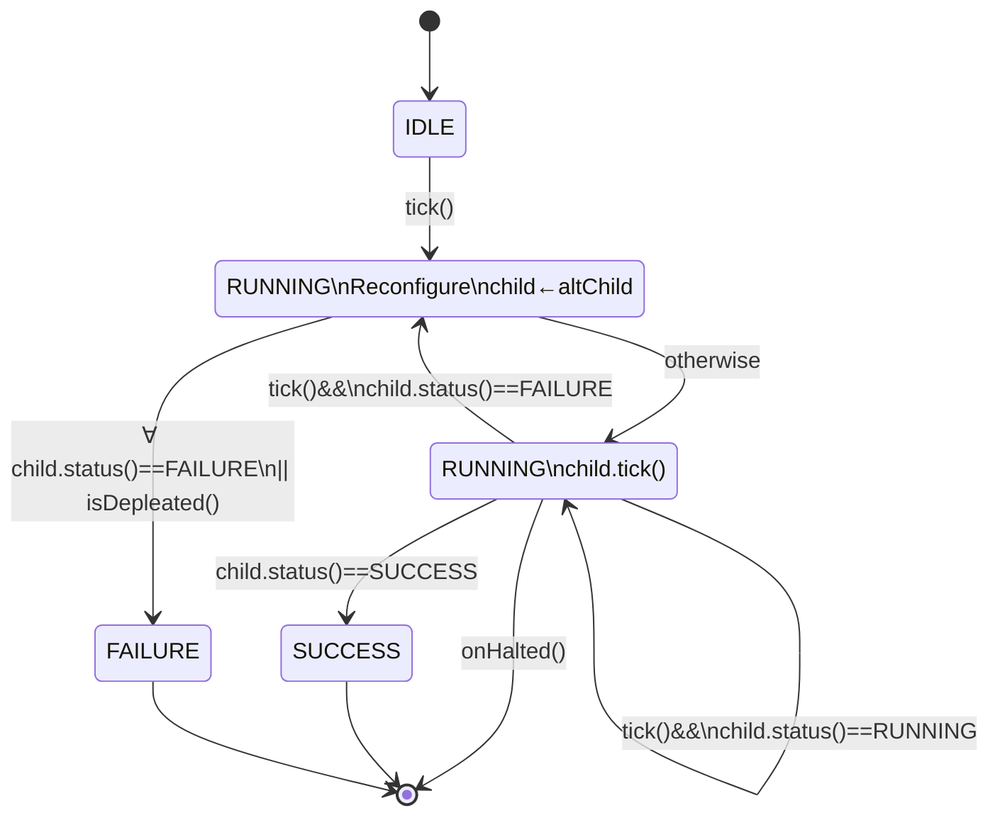
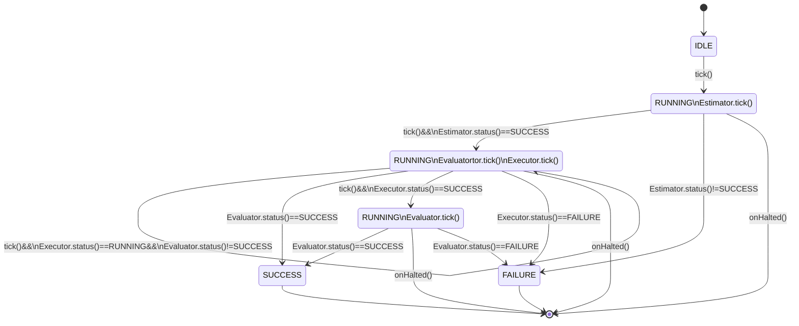

# ReFRESH (Reconfigurable Framework for Real-time Embedded Software and Hardware)

This is a ROS integration of the ReFRESH framework as a middleware for real-time self-adaptation of robotic systems on both behavior and composition, involving both software and hardware.

Based on BehaviorTree.CPP and Actionlib, this ROS package extends the run-time self-adaptation capability of ROS. The framework of ReFrESH is referred to (Cui et. al, 2015), where a Evaluator and Estimator are added to the functional component (Executor) to achieve run-time self-awareness. A decider reconfigures the system on-the-fly based on the EV and ES outputs. This package further extends the work of ReFRESH by decoupling behavior and logic concerns. Hence, it consists of High-Level (behavior) adaptation modules powered by a behavior tree, and Low-Level (component and logic) adaptation modules integrated with the native ROS API.

## Infrastructure of Real-Time Self-Adaptation
The package provides three types of Action nodes, and two types of Control nodes. The Control nodes include a Decider node and a Module node. State machines of the two nodes are as followed:

- Decider Node (`ReFRESH_Decider`)
  
  Allow connection to multiple children, ranked in ascending order of weighted costs and (if the costs are the same) the connection order for execution. It allows connection to both `ReFRESH_Module` and non-`ReFRESH_Module` (in which costs will be `1.0-FLT_EPSILON` for `SUCCESS` or `1.0` for `FAILURE`, to guarantee the priority of `ReFRESH_Module`s).
  
  N.B. The reconfigure logic currently adopts a weighted sum of normalized performance and resource costs as the ranking metric, and adopts the candidate with minimum weighted metric and feasible costs (0 <= {resource, performance} cost < 1).

- Module Node (`ReFRESH_Module`)

  Connects to maximum of three, and minimum of one child (children), in the order of Executor, Evaluator, and Estimator. If no Estimator is provided, a constant `SUCCESS` is used as the belief. If no Evaluator is provided, a constant `FAILURE` is used during initial `tick()` to initiate the Executor. Then the resultant state of the Executor is used as the state of the Evaluator.
  
  N.B. The Evaluator is tested on the first call to see if it is synchronous or asynchronous (whether it has the state `RUNNING`). If the Evaluator is synchrounous, it would not receive `tick()` again unless the Executor has finished.

Three Action nodes are provided, i.e. the Executor, Evaluator, and the Estimator. The Executor is a ROS `SimpleActionClient` of the action type `HighLevelRequest`. The Evaluator utilizes the feedback of the ROS action. The Estimator is a `SimpleServiceClient` of the service type `ModuleEstimate`.

## BehaviorTree.ROS

[BehaviorTree.CPP](https://github.com/BehaviorTree/BehaviorTree.CPP) is a __middleware independent__ framework 
to develop Behavior Trees in C++.

The library is not particularly opinionated about the way Actions and Conditions should be created; this gives
more freedom to the developer, but can also be confusing for those people which are getting started with it.

Consequently, many people in the [ROS](http://www.ros.org) community asked for examples and guidelines;
this repository try to provide some basic examples.

Currently, two wrappers are provided:

- [RosServiceNode](include/behaviortree_ros/bt_service_node.h), which can be used to call
  [ROS Services](http://wiki.ros.org/Services)

- [RosActionNode](include/behaviortree_ros/bt_action_node.h) that, similarly, is a wrapper around
  [actionlib::SimpleActionClient](http://wiki.ros.org/actionlib).

